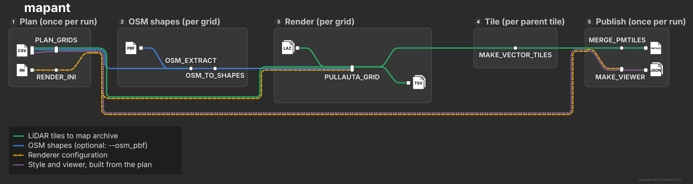

# mapant-nf

[](https://github.com/grst/mapant-nf/actions/workflows/ci.yml)
[](https://github.com/grst/mapant-nf/actions/workflows/containers.yml)

`mapant-nf` is a [Nextflow](https://www.nextflow.io/) pipeline that automatically generates [orienteering](https://en.wikipedia.org/wiki/Orienteering) maps from LIDAR tiles and open street map annotations.
The heavy lifting is done by [karttapullautin](https://github.com/karttapullautin/karttapullautin), and a web-mercator tile pyramid is generated using [karttapullautin2tiles](https://github.com/grst/karttapullautin2tiles). 
This workflow pipes these tools together in a scalable way, ready to generate a ["mapant"](https://mapant.net/) map of a whole country. 

Nextflow is a workflow manager that provides implicit parallelization and abstracts the compute environment. 
All it takes to adapt this workflow to run on a single machine, a HPC, or a cloud batch system is changing a few lines of configuration.
All dependencies are containerized.



## Quickstart

### Prerequisites

* [nextflow](https://nextflow.io/)
* a [container runtime](https://docs.seqera.io/nextflow/container), typically [docker](https://www.docker.com/), [podman](https://podman.io/), or [apptainer](https://apptainer.org/). 
* an [execution environment](https://docs.seqera.io/nextflow/executor), e.g. a local machine, a HPC, or a cloud batch system. 

### Test run

Run the pipeline on a predefined region around Immenstadt i. Allgäu. 
This helps checking if the everything is set up correctly on your system.  

```bash
# ~15 minutes; downloads ~5.4 GB of LiDAR from the source server
nextflow run grst/mapant-nf -profile podman,test_immenstadt
```

### Real run

The minimal command to execute the pipeline on custom data is the following. 
Adjust paths and container profile as needed.

```bash
nextflow run grst/mapant-nf \
  --tiles_csv laz_tiles.csv \
  --osm_pbf bayern-latest.osm.pbf \
  --outdir output \
  -profile docker \
  -resume
```

where `tiles_csv` is an input samplesheet with download links to every tile (see an [example](./assets/laz_tiles_immenstadt.csv)) and `osm_pbf` is a file containing open street map data (you can download e.g. from [geofabrik.de](https://download.geofabrik.de/)).

In a real production setting, you most likely want to specify additional parameters and provide them as yaml file via
`-params-file`. Additionally, it can make sense to optimize resource requirements for the individual processes and 
provide them as a nextflow config file (`-c`). For reference, the full configuration used to generate [Mapant Bayern](https://mapant.orienteering-allgaeu.de) is available [here](https://github.com/grst/mapant-bayern/tree/main/processing_pipeline).

All available pipeline parameters are documented in the [nextflow schema](./nextflow_schema.json) of this pipeline. 

## Performance and cost

This pipeline was used to generate [Mapant Bavaria](https://github.com/grst/mapant-bayern). 
Bavaria has an area of ca. 70,541 km². Downloading and processing the corresponding 71979 LIDAR tiles (ca. 15 TB) 
on a `c8id.32xlarge` AWS EC2 instance with 256GB or memory and 128 vCPU this completed in 27h wall time, 
consuming 5042 CPU hours. With on-demand pricing, this cost of the run was a little less than 200 USD. 

This corresponds to 0.07 CPUh or 0.0028 USD per tile.

## Processes

 * `PLAN_GRIDS` processes the samplesheets and separates it into grids that are processed by a single `karttapullautin` run. 
   A grid consists of "core tiles" and one ring of halo to avoid edge artifacts. 
 * `RENDER_INI` generates a `.ini` file for `karttapullautin` based on the pipeline parameters. 
 * `OSM_EXTRACT` uses `osmium` to extract OSM shapes that overlap with each grid. 
   The shapes are subsequenctly converted to `*.shp.zip` files that can be read by `karttapullautin` in `OSM_TO_SHAPES`
 * `PULLAUTA_GRID` runs `karttapullautin` on the grids defined earlier. The generates the raw png tiles and collects
   processing errors in a TSV file. 
 * `MAKE_TILES` runs `karttapullautin2tiles` to process the pngs generated by `karttapullautin` into a web mercator tile pyramid.

## Output data

A `{z}/{x}/{y}.webp` tile pyramid folder and a HTML file that allows to view it.

## Transparent use of AI

The pipeline was implemented using Claude Opus 5. The prompts are documented in [prompts.md](prompt.md). 
This README is hand-crafted by a human.

## Contact

If you have feedback or questions regarding this pipeline, feel free to open [an issue](https://github.com/grst/mapant-nf/issues) or contact me via one of the options listed in my [GitHub profile](https://github.com/grst).