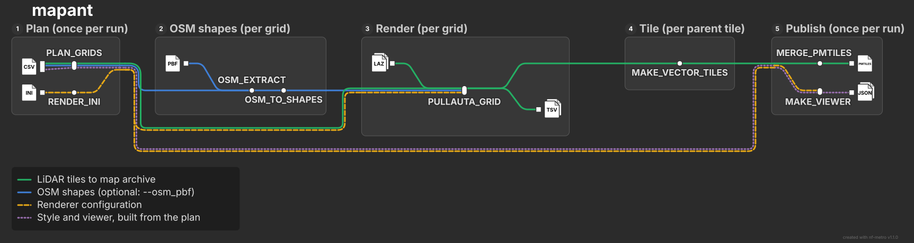

# mapant-nf

[](https://github.com/grst/mapant-nf/actions/workflows/ci.yml)
[](https://github.com/grst/mapant-nf/actions/workflows/containers.yml)

`mapant-nf` is a [Nextflow](https://www.nextflow.io/) pipeline that
automatically generates
[orienteering](https://en.wikipedia.org/wiki/Orienteering) maps from LIDAR tiles
and open street map annotations. The heavy lifting is done by
[karttapullautin](https://github.com/karttapullautin/karttapullautin) which does
the LIDAR point cloud to map conversion. The latest version of the pipeline is
based on [a
fork](https://github.com/grst/karttapullautin/tree/feature/vector-stack) of
karttapullautin that directly generates vector data for each tile as GeoJSON.
Then, [tippecanoe](https://github.com/felt/tippecanoe) converts it into one
[PMTiles](https://docs.protomaps.com/pmtiles/) archive of vector tiles in the
schema of the [isom-maplibre](https://github.com/MetsaApp/isom-maplibre) style.
This workflow pipes these tools together in a scalable way, ready to generate a
["mapant"](https://mapant.net/) map of a whole country.

Nextflow is a workflow manager that provides implicit parallelization and
abstracts the compute environment. All it takes to adapt this workflow to run on
a single machine, a HPC, or a cloud batch system is changing a few lines of
configuration. All dependencies are containerized.



## Quickstart

### Prerequisites

- [nextflow](https://nextflow.io/)
- a [container runtime](https://docs.seqera.io/nextflow/container), typically
  [docker](https://www.docker.com/), [podman](https://podman.io/), or
  [apptainer](https://apptainer.org/).
- an [execution environment](https://docs.seqera.io/nextflow/executor), e.g. a
  local machine, a HPC, or a cloud batch system.

### Test run

Run the pipeline on a predefined region around Immenstadt i. Allgäu. This helps
checking if the everything is set up correctly on your system.

```bash
# ~15 minutes; downloads ~5.4 GB of LiDAR from the source server
nextflow run grst/mapant-nf -profile podman,test_immenstadt
```

### Real run

The minimal command to execute the pipeline on custom data is the following.
Adjust paths and container profile as needed.

```bash
nextflow run grst/mapant-nf \
  --tiles_csv laz_tiles.csv \
  --osm_pbf bayern-latest.osm.pbf \
  --outdir output \
  -profile docker \
  -resume
```

where `tiles_csv` is an input samplesheet with download links to every tile (see
an [example](./assets/laz_tiles_immenstadt.csv) and the
[schema](./assets/schema_tiles.json)) and `osm_pbf` is a file containing open
street map data (you can download e.g. from
[geofabrik.de](https://download.geofabrik.de/)).

In a real production setting, you most likely want to specify additional
parameters and provide them as yaml file via `-params-file`. Additionally, it
can make sense to optimize resource requirements for the individual processes
and provide them as a nextflow config file (`-c`). For reference, the full
configurations used to generate [Mapant
Germany](https://mapant.orienteering-allgaeu.de) is available
[here](https://github.com/grst/mapant-germany/tree/main/processing_pipeline).

All available pipeline parameters are documented in the [nextflow
schema](./nextflow_schema.json) of this pipeline.

## Performance and cost

This pipeline was used to generate [Mapant
Germany](https://github.com/grst/mapant-germany). The pipeline was invoked for
each federal state separately. As an example, Bavaria has an area of ca. 70,541
km². Downloading and processing the corresponding 71979 LIDAR tiles (ca. 15 TB)
on a `c8id.8xlarge` AWS EC2 instance with 64GB or memory and 32 vCPU this
completed in 34h wall time, consuming 1088 allocated CPU hours. With on-demand
pricing, this cost of the run was about 60 USD. This corresponds to 0.0109 CPUh
or 0.00083 USD per tile.

This is a significant improvement over a previous version of the pipeline that
used an older version of karttapullautin, which used 5042 CPU hours for Bavaria
(0.07 CPUh or 0.0028 USD per tile).

## Processes

- `PLAN_GRIDS` processes the samplesheet and separates it into grids that are
  processed by a single `karttapullautin` run. A grid consists of "core tiles"
  of one configuration and one ring of halo to avoid edge artifacts.
- `RENDER_INI` generates a .ini file for karttapullautin based on the pipeline
  parameters.
- `OSM_EXTRACT` uses `osmium` to extract OSM shapes that overlap with each grid.
  The shapes are subsequenctly converted to `*.shp.zip` files that can be read
  by `karttapullautin` in `OSM_TO_SHAPES`.
- `PULLAUTA_GRID` downloads the tiles and runs karttapullautin on the grids
  defined earlier. The process generates GeoJSON files that can be read by
  `tippecanoe`. The download is included in this process rather than a separate
  one to reduce disk space used by the nextflow `work` directory.
- `MAKE_VECTOR_TILES` processes the GeoJSON files into `pmtiles` archives in
  parallel.
- `MERGE_PMTILES` creates the final pmtiles file based on the different grids.
- `MAKE_VIEWER` writes a MapLibre style and a preview page for the archive.

## Output data

`map/mapant.pmtiles`, one PMTiles archive of 512 px vector tiles. The archive
follows [isom-maplibre](https://github.com/MetsaApp/isom-maplibre)'s schema.

## Transparent use of AI

The pipeline was implemented using Claude Opus 5 and 5.5. The prompts are
documented in [prompts.md](prompt.md). This README is hand-crafted by a human.

## Contact

If you have feedback or questions regarding this pipeline, feel free to open [an
issue](https://github.com/grst/mapant-nf/issues) or contact me via one of the
options listed in my [GitHub profile](https://github.com/grst).

## FAQ

### karttapullautin can't output GeoJSON, what's going on here?

As of 2026-10-06, the official version of kp indeed can't output GeoJSON.
However, there has been work on this behind the scenes and the features will
slowly make it upstream. See
[karttapullautin/karttapullautin#116](https://github.com/karttapullautin/karttapullautin/issues/116)
for the discussion.

In brief, @malpou implemented vectorization and GeoJSON in [his
fork](https://github.com/malpou/karttapullautin/). Built on top of that, I
vibe-coded some [additional
modifications](https://github.com/grst/karttapullautin/pull/3) to make it work
end-to-end with this pipeline.

### Screw nextflow, I just want to convert output of my local karttapullautin run to pmtiles

Using [tippecanoe](https://github.com/felt/tippecanoe) will get you pretty far,
but it requires proper configuration to show the right level of detail at each
level and not omit any details on busy tiles. Take a look at
[`bin/make_vector_tiles.py`](https://github.com/grst/mapant-nf/blob/main/bin/make_vector_tiles.py)
to inspect how it is done in this pipeline.
